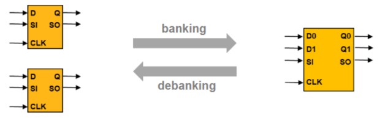
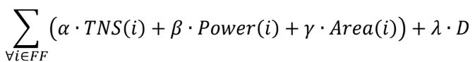

# 2024_ICCAD_Contest_Problem_B
## 2024 ICCAD Contest - Problem B: Power and Timing Optimization Using Multibit Flip-Flop

---
### 1 Introduction
In advanced semiconductor technology nodes, minimizing power and area is a key concern. A common technique is to replace single-bit flip-flops with multibit flip-flops, which saves area and simplifies power, ground, and clock routing.
This process is known as “multibit flip-flop banking.” However, banking can sometimes worsen timing for critical nets, potentially reducing overall optimization. To address this, “multibit flip-flop debanking”—splitting multibit flip-flops back into single-bit ones—is sometimes necessary.  
  
This contest simulates banking and debanking decisions in virtual designs, requiring contestants to optimize timing, power, and area for each testcase.  
  

---
### 2 Contest Objective
In this contest, the input includes combinational gates and sequential flip-flops. Contestants must preserve the placement and connections of combinational gates, which cannot be moved or altered. Only flip-flops may be moved, banked, or debanked as needed.  
  
The contestants need to develop a banking & debanking algorithm that banks or debanks flip-flops to optimize timing, power, and area while meeting cell density constraints and avoiding cell overlap.  
  
The cost metrics of calculating timing, power, and area for this contest is as follows:  
  
  
  
Where i stands for every flip-flop instance in the design. TNS(i) stands for the total negative slack of the
flip-flop. Power(i) stands for the power consumption of the flip-flop. Area(i) stands for the area cost of
the flip-flop. The design is divided into several bins, and we will define a utilization rate threshold for
each bin in the design. D stands for the number of bins that violates the utilization rate threshold. α, β,
γ, and λ are weight for each cost.

---
### 3 Constraints
 - All instances must be placed within the die region.
 - All instances must be without overlap and placed on-site of PlacementRows.
 - A list of banking and debanking mapping needs to be provided.
 - Nets connected to the flip-flops must remain functionally equivalent to the data input. The result should not leave any open or short net.

